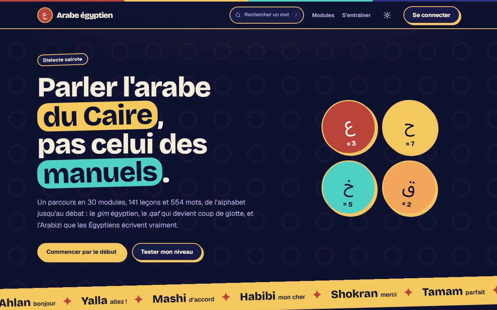
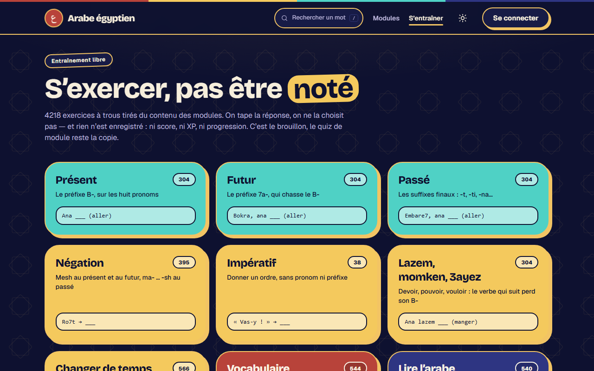

# Arabe égyptien

**Apprendre à parler l'arabe du Caire, pas celui des manuels.**

Une application web gratuite, en français, pour apprendre le dialecte égyptien du niveau
A1 au B2 : alphabet, Arabizi, vocabulaire, grammaire et conjugaison.

🔗 **Site en ligne : https://egyptian-arabic-app-phi.vercel.app**



## Fonctionnalités

- **Parcours de 30 modules, 141 leçons et 554 mots** : 14 modules progressifs de A1 à B2,
  plus des modules thématiques (nourriture, corps, métiers, couleurs…) et une référence
  de conjugaison.
- **Quiz de module** : une banque de 941 questions. Chaque tentative en tire 10 au hasard ;
  il faut 70 % pour valider le module.
- **Entraînement libre** : 4 218 exercices à trous (présent, futur, passé, négation,
  impératif, vocabulaire, lecture de l'écriture arabe…). On tape la réponse au lieu de la
  choisir.
- **Écriture** : tracer les 28 lettres de l'alphabet au doigt, à la souris ou au stylet,
  et obtenir un pourcentage de ressemblance avec le modèle.
- **Test de positionnement** : 12 questions pour savoir par quel niveau commencer.
- **Leçon du jour** : une révision quotidienne des mots des leçons déjà lues.
- **Suivi de progression** : compte utilisateur, leçons lues, XP et tableau de bord.
- **Glossaire** : tout le vocabulaire, cherchable en arabe, en Arabizi et en français.
- **Traductions après chaque réponse** : la traduction de chaque choix s'affiche une fois
  la question corrigée.
- **Thème clair / sombre**, site adapté au mobile, accessible au clavier et aux lecteurs
  d'écran.

| Chemin des leçons d'un module | Entraînement libre |
|---|---|
|  |  |

## Technologies

- [Next.js 16](https://nextjs.org) (App Router, Server Components) + TypeScript
- [Tailwind CSS v4](https://tailwindcss.com)
- [Supabase](https://supabase.com) : base PostgreSQL, authentification, sécurité par
  lignes (RLS)
- Hébergement sur [Vercel](https://vercel.com) : chaque push sur `main` est déployé
  automatiquement.

## Comment ce projet a été fait

J'ai conçu ce projet avec l'aide d'une IA,
[Claude Code](https://claude.com/claude-code), qui a écrit une grande partie du code. Mon
rôle :

- définir ce que l'application devait faire et pour qui ;
- fournir et organiser le contenu pédagogique ;
- choisir le design parmi plusieurs maquettes ;
- tester le site, repérer ce qui n'allait pas (questions trop répétitives, pages lentes,
  design trop « scolaire ») et demander les corrections ;
- modifier moi-même le code quand le résultat proposé ne me convient pas ;
- déployer et maintenir le site.

## Organisation du code

```
app/          une route par dossier (pages, actions serveur)
components/   blocs d'interface réutilisables
lib/          logique partagée (contenu, authentification, progression, quiz)
data/         contenu pédagogique source, en JSON
scripts/      outils locaux : import, génération des quiz et des exercices
supabase/     schéma de la base (migrations SQL)
```

Le rôle de chaque fichier est décrit dans [ARCHITECTURE.md](ARCHITECTURE.md).

## Lancer le projet en local

Prérequis : Node.js 20 ou plus récent et un projet Supabase.

### 1. Installer

```bash
npm install
```

Copier `.env.example` en `.env.local` et renseigner les valeurs (Supabase → Project
Settings → API keys) :

- `NEXT_PUBLIC_SUPABASE_URL` et `NEXT_PUBLIC_SUPABASE_ANON_KEY` : utilisées par
  l'application.
- `SUPABASE_SECRET_KEY` : utilisée **uniquement** par les scripts d'import, jamais exposée
  au navigateur et jamais configurée sur Vercel, car elle contourne les règles RLS.

### 2. Créer le schéma

Dans Supabase → SQL Editor, exécuter dans l'ordre les fichiers de `supabase/migrations/` :

1. `001_initial_schema.sql` : tables de base et RLS sur les données des utilisateurs
2. `002_lock_content_writes.sql` : contenu en lecture seule pour le public
3. `003_public_read_policies.sql` : lecture publique explicite du contenu
4. `004_profiles_on_signup.sql` : création du profil à l'inscription
5. `005_lesson_completions.sql` : leçons lues
6. `006_daily_reviews.sql` : historique de la leçon du jour

> Le `003` est indispensable. Sans lui, si RLS est activé sur les tables de contenu, les
> lectures anonymes renvoient un tableau vide **avec un statut 200**, sans erreur.
>
> Le `004` est indispensable à l'authentification : `profiles` n'a pas de policy INSERT, un
> utilisateur ne peut donc pas créer sa propre ligne. Le trigger s'en charge.
>
> Le `005` repère une leçon par `(module_id, lesson_order_index)` et non par son UUID :
> `npm run import` régénère les UUID, une clé étrangère effacerait toute la progression à
> chaque réimport.

### 3. Importer le contenu

```bash
npm run normalize       # uniformise la translittération en Arabizi (ʿ → 3, ḥ → 7, ʾ → 2)
npm run import          # charge data/*.json dans Supabase (rejouable)
npm run generate:quiz   # génère la banque de quiz depuis le vocabulaire importé
npm run generate:drills # génère data/exercises.generated.json (exercices d'entraînement)
```

Après tout ajout de contenu, relancer ces quatre commandes dans cet ordre.

- `generate:quiz` ne remplace que les questions de type `mcq`. Les questions écrites à la
  main (compréhension du module 14) sont conservées. Ajouter `-- --dry-run` pour vérifier
  sans rien écrire en base.
- `generate:drills` n'écrit pas en base : l'application lit directement le fichier généré,
  qui est versionné. La génération est déterministe, donc un `git diff` vide veut dire « le
  contenu n'a pas changé ».

### 4. Démarrer

```bash
npm run dev
```

Le contenu est mis en cache une heure côté serveur : un réimport peut mettre jusqu'à une
heure à apparaître. Pour le voir tout de suite en production, redéployer.

## Données

`data/` contient le contenu pédagogique :

- `module-01.json` … `module-14.json` : le parcours principal, un module par fichier, avec
  ses leçons (des « jours »), son vocabulaire et, pour le module 14, des questions de
  compréhension.
- `module-<thème>.json` : les modules thématiques (animaux, nourriture, maison…).
- `conjugations-core.json` : la référence de conjugaison. Elle n'a pas la forme d'un module
  par jours ; l'import la convertit en module `conjugations-core` (une leçon par règle, puis
  un paradigme complet par verbe).
- `exercises.generated.json` : les exercices d'entraînement, produits par
  `generate:drills`.

### Correspondances non triviales entre le JSON et la base

| Source JSON | Base | Note |
|---|---|---|
| `module.generation_note` (module-05) | — | Pas de colonne, ignoré à l'import |
| `quiz_questions[].question_fr` (module-14) | `quiz_questions.options` | Stocké en `{"question_fr": "..."}` |
| `quiz_questions[].answer` | `quiz_questions.correct_answer` | `type` vaut `comprehension` |
| `vocab_items[].arabic` absent | `vocab_items.arabic = null` | Certains documents sources n'avaient que la translittération |
